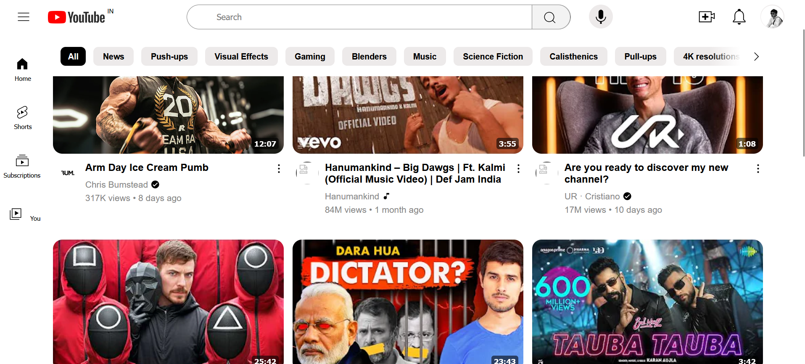

# YouTube Homepage Clone

A responsive front-end clone of the YouTube homepage built using **HTML** and **CSS**. This project was created to practice modern web design principles, responsive layouts, and CSS styling techniques.

> **Disclaimer:** This project is developed for educational purposes only and is not affiliated with or endorsed by YouTube or Google.

---

## Live Demo

🔗 **Live Website:**
https://najmudheenpk.github.io/youtube-homepage-clone/

---

## Screenshot



---

## Features

* Responsive homepage layout
* Navigation bar
* Sidebar navigation
* Video cards
* Search bar
* Clean and modern UI

---

## Technologies Used

* HTML5
* CSS3

---

## Project Structure

```text
youtube-homepage-clone/
│
├── index.html
├── style.css
├── youtube-homepage.png
└── README.md
```

---

## What I Learned

* Semantic HTML structure
* CSS Flexbox
* CSS Grid
* Image optimization
* Layout structuring
* UI recreation from an existing website

---


## Author

**Najmudheen PK**

GitHub: https://github.com/najmudheenpk
